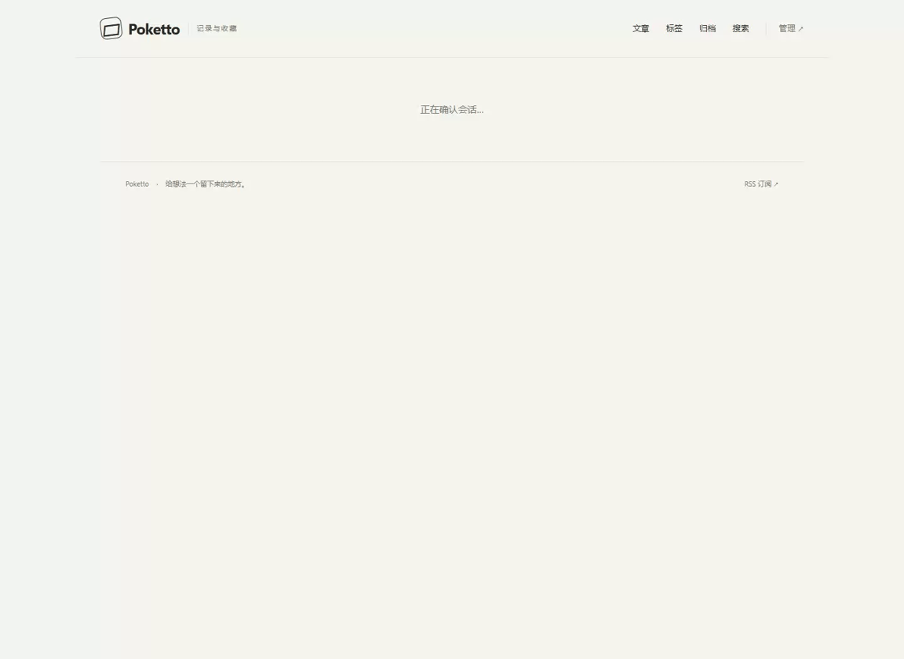

# Content-root switching acceptance

Source: `78d97c48afb0e8688220ad6ca9f7610f9f6df4ae`. The real Spring/PostgreSQL/Next.js/Caddy acceptance stack used a fresh synthetic Git repository and original store, started with `docker compose -f acceptance/compose.yaml up --build -d` and disposable fixture settings. Chrome 153.0.8010.36 recorded one flow at 1440 × 1050; the GIF is sampled at two frames per second and resized to 1152 × 840.

The flow cancels a scope selection with focus restoration, rejects publication of a single file whose attachment stays private, publishes the folder with its indexed original, and returns the folder to private. Independent HTTP checks verify exact original bytes, preserved media identity, public article withdrawal and invalidation of the old media URL. The new-file path starts under `private/`. [Machine receipt](checks.json) records the checks and synthetic commits. All fixture containers and volumes were removed.

[Dependency refusal](private-dependency-refused.png), [public folder](folder-public.png), [private folder](folder-private.png).

This establishes the browser flow with real local services. It does not establish production content, HTTPS or model behavior.
