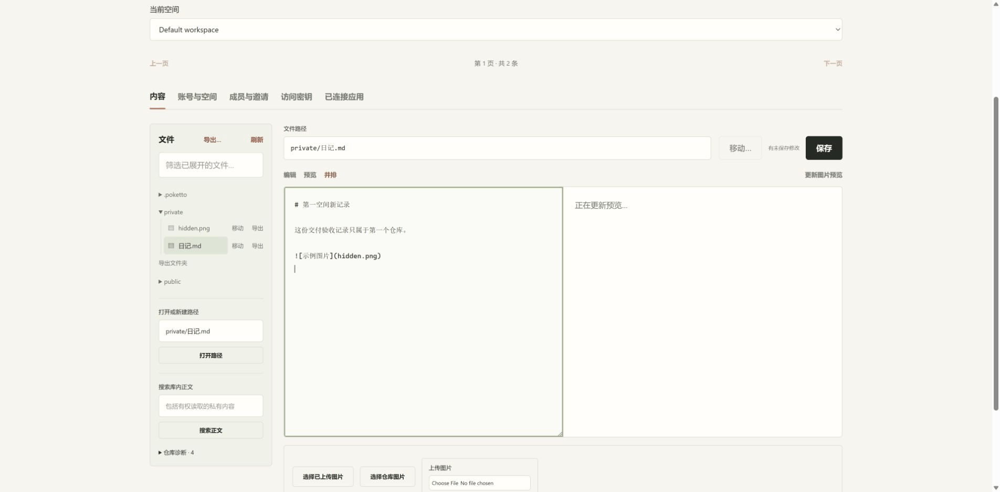

# Workspace entrance acceptance

Source: `15053429ee96da52dc40dbb327b155e317da0b7c`.

The real Spring, pinned PostgreSQL, production Next.js and Caddy services ran through `acceptance/compose.yaml`, with fresh disposable data, the optional second-workspace seed, port 38887, and an OAuth issuer override for local testing. The start command was `docker compose --env-file <disposable-env> -p poketto-delivery-spaces-20260912 -f acceptance/compose.yaml -f <issuer-overlay> up --build -d`. Both workspaces used independent synthetic remote Git repositories. Chrome captured a 1905 x 938 viewport.

This sampled recording follows one browser flow: edit the first space, attempt a switch, cancel and retain the draft, save, open the reading room, save different content at the same path, then return and reopen the unchanged first file. The final preview includes the first space's private image. Frames include intermediate opening and saving states; the second-space opening frame precedes its editor content. Each frame displays for 1.8 seconds for readability, not measured operation timing.

The same run also saved through two independent browser tabs. Reading both Git authorities after the browser operations confirmed each repository held its own expected content and excluded the other space's title. [The receipt](checks.json) records both remote commits, content hashes, source state and artifact hashes.

This establishes local workspace routing, unsaved-draft protection and preview recovery with real services. It does not establish production HTTPS, external provider provisioning, an actual MCP client session, or transition timing. Repository creation retry and OAuth selection also have automated frontend coverage; they are not depicted in this recording.
