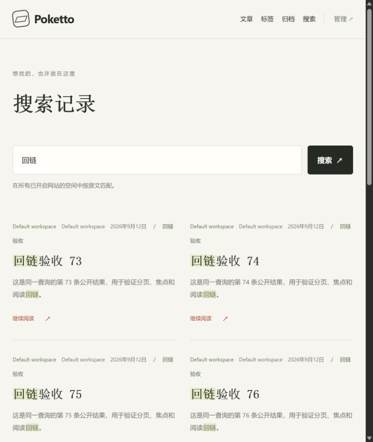
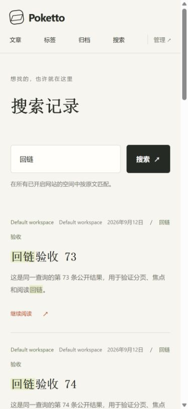
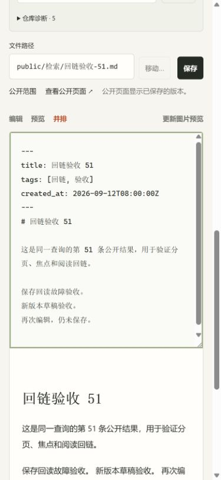
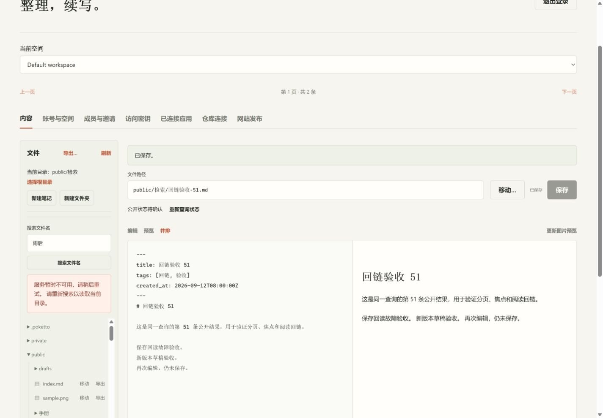

# Daily-use interface acceptance

Demonstrated application source: `577384c12a1c569bfbeb9cdb86ae016af5a7c9e5`.
PR #128 head `6d51acb4f6b1d339d438cfb194ca36a7bac020ae` adds documents and main's OAuth callback change; the demonstrated frontend and content code are unchanged. Backend classes were staged at `a35137bdca5a3b4a221daf9c960572c8765b4daa`; the subsequent runtime fixes affect only the frontend.

The isolated stack runs actual Spring, PostgreSQL, a production Next.js build and Caddy, with two independent synthetic Git repositories and fresh disposable fixture credentials. It starts through `./gradlew check stageAcceptanceRuntime`, frontend image build, and `docker compose --project-name poketto-daily-ui-20260914 --env-file acceptance/.env -f acceptance/compose.yaml up -d`. No production content or credentials were used.

## Search

Each sample space has 79 matching articles. The combined query returns 158 and offset 72 crosses the space boundary. Opening the second space's result and returning restored the query, page and selected result in the live DOM. These static screenshots show the restored page's opening results and responsive layout; they do not visually prove the complete interaction.

## Save and publication state

The mobile editor retains a new draft after a save, enables Save and removes the previous success notice. The public link still refers to saved content. Desktop fault injection makes only GET file metadata and filename searches return 503 at Caddy, while real Spring/Git writes continue. Save remains acknowledged with its button disabled; public status is unconfirmed and the filename error describes a read failure. A later read-only retry after restoring Caddy restores the public link without overwriting a newer draft.

The browser returns JPEG screenshot bytes at the dimensions recorded in [checks.json](checks.json), which differ from CSS viewport dimensions. Files are unedited captures; only their extensions were corrected to match the encoded format. The record lists artifact hashes, exact observations and limitations. Screenshots were inspected for sensitive data and legibility. Synthetic content labels are not claims about production data.

This run also verifies filename paging (50 plus 29), dirty-navigation cancellation, private and unsaved destinations, independent spaces, public readback and website withdrawal. The intentional gateway fault and website switch were restored. It does not establish production HTTPS, provider interoperability, or external ChatGPT/Claude acceptance.
## Installed worker timing

A separate disposable 512 MiB XFS fixture used the installed DiskSystemdBackend and SRT within the configured resource slice. The installed worker source revision was `afbfe17566fd95799b3cdec23631f63f9a7a799e`; its runtime files are byte-identical through the UI delivery. One 289-byte synthetic Git bundle opened in 672.02 ms. Twenty sequential `cat note.md` commands averaged 525.39 ms, with p95 612.98 ms. [Raw measurements](disk-copy-timing.json) include all samples and successful cleanup.

This measures native worker startup and command isolation for a tiny fixture. It excludes application admission, MCP transport, provider latency and large-corpus clone cost. An initial attempt outside the configured resource slice was rejected by the worker preflight and cleaned up; the measured run used the normal required slice. No existing account copy was used or removed.