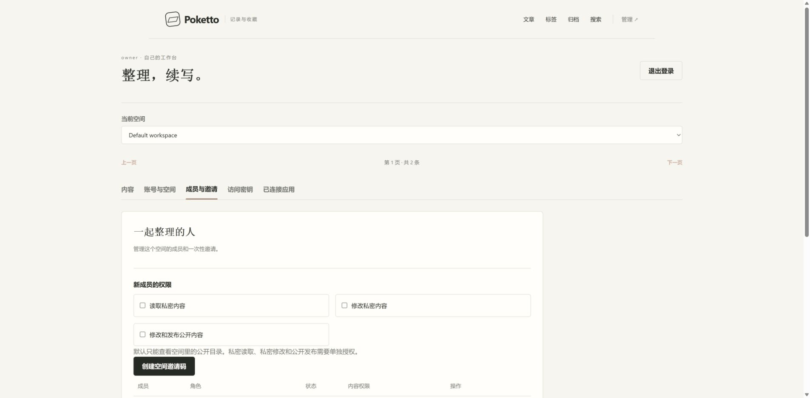

# Member permissions browser evidence

Demonstrated source: `741048a951fad5e254cdd103652221c9f4b47d2d`, from a clean product worktree held unchanged throughout one isolated run.

The nine original browser frames show default empty invitation grants, public-only reading, refusal of a private path while retaining the public preview, the public image picker, a successful public save, a public rename, the updated article, the inserted image after that move, and the owner's final readback of publication-only permission. Frames retain their capture order. Login, fixture setup and the grant-selection interaction are omitted. Each GIF frame lasts 1.8 seconds for reading; it does not measure transition timing. Original PNGs preserve full screenshot colors.

The run uses real Spring application classes, pinned PostgreSQL, a production Next.js build, Caddy and two independent synthetic remote Git repositories. Start with `docker compose -p poketto-member-ui-review-20260912 --env-file .gradle/member-ui-review/acceptance.env -f acceptance/compose.yaml up --build -d` after staging the demonstrated source with `stageAcceptanceRuntime`. The disposable environment file and credentials are not included. Chrome viewport is 1920 x 945; captured images are 1905 x 938.

Independent Git readback verifies the complete saved source, preserved metadata and unedited text, retained relative image link, repaired public backlink, removed old path, unchanged private content and unchanged second repository. Authenticated HTTP reads independently confirm that private and excluded source return 403 and that the member has only `EXECUTE_REPOSITORY` and `PUBLISH`. See [checks and artifact hashes](checks.json).

This loopback HTTP fixture does not prove production HTTPS, external OAuth/MCP client interoperability, provider provisioning or public-only machine authoring. Browser images exercise repository-backed public media; native Linux tests separately cover indexed managed images. This artifact branch is evidence only and must not be merged into the product branch.
