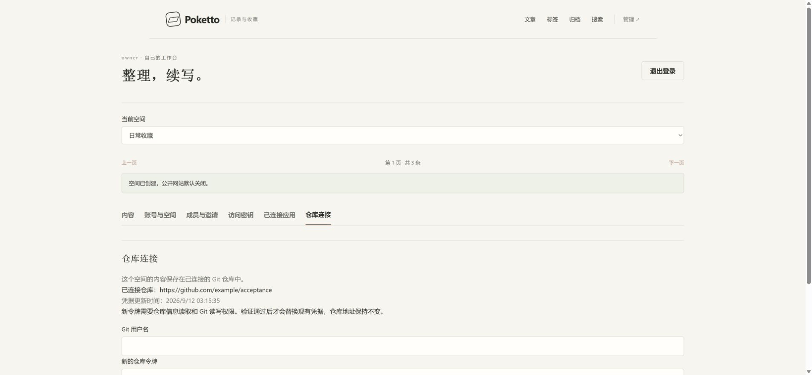

# Repository credential settings browser evidence

Source: `a6e43bb2b3e9c3c6c4eaffdaa348fd54d4b6fb2d`, clean and unchanged throughout the run.

Three original Chrome frames show the managed repository address, rejection of an invalid synthetic token, and successful replacement with the inputs cleared and timestamp refreshed. Frames come from one fresh run in capture order; two seconds per frame is reading time, not measured timing. Login, workspace creation and token entry are omitted. The deployment-managed page was also checked but is not in this recording. Original PNGs retain full screenshot colors.

The real Spring authentication and workspace services, PostgreSQL, credential encryption and rotation compare-and-set, production Next.js build and Caddy run locally. The integration-only provider fixture mocks repository metadata and credential verification; no request or credential is sent to GitHub or CNB. Content uses a synthetic local Git repository. This evidence demonstrates the explicitly mocked provider mode, not provider interoperability.

Start with `stageAcceptanceRuntime`, then `docker compose -p poketto-credential-ui-20260912 --env-file .gradle/credential-ui/acceptance.env -f acceptance/compose.yaml up --build -d`. The disposable environment file is not included. The managed-connection fixture mode and a disposable encryption key are required as described in the product's acceptance README. Chrome viewport is 1920 x 889; the recording frames are 1905 x 882.

Independent PostgreSQL readback verifies that invalid rotation preserves the binding, ciphertext and timestamp; successful rotation changes ciphertext and timestamp while preserving workspace, repository and private-by-default website state. An independent authenticated metadata read verifies `Cache-Control: no-store` and the absence of credentials. [Checks and artifact hashes](checks.json) record these observations. Required integration tests cover anonymous, outsider and ordinary-member denial; those cases are not shown in this owner browser flow.

This local HTTP run does not establish production HTTPS or real GitHub/CNB authentication. This orphan branch holds evidence only and must not be merged into product history.
