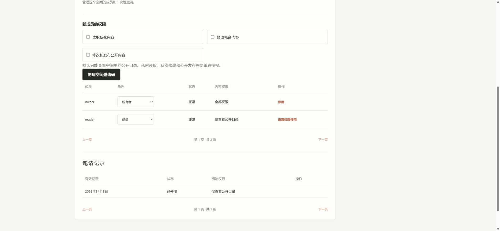

Current evidence for PR #86: [source 741048a](741048a/README.md). The files below retain the earlier run for source 742f193.

# Member permission browser evidence

Application source: `742f193ad2e227e3228bc140f04af6f435c5fc67`.

The recording follows one fresh owner/member flow through the real Spring application, pinned PostgreSQL, production Next.js frontend, Caddy and two independent synthetic Git repositories. Invitations default to public reading. A denied private-file open preserves the loaded public preview. After receiving publication permission alone, the member saves and renames public content; the private destination control stays disabled.

[checks.json](checks.json) records the startup command, browser dimensions, exact source commit, frame hashes and independent Git readback. The saved source preserves metadata and unedited text, public backlinks follow the rename, and private files and the second workspace remain unchanged. Private and excluded source requests return 403.

The GIF contains seven original browser frames from one run, displayed for 1.8 seconds each. It demonstrates successive states, not measured transition timing. Login and fixture setup are omitted. This local HTTP fixture does not prove production HTTPS, external OAuth/MCP interoperability, provider provisioning or public-only machine authoring.

This branch contains review artifacts only and must not be merged into the product branch.
