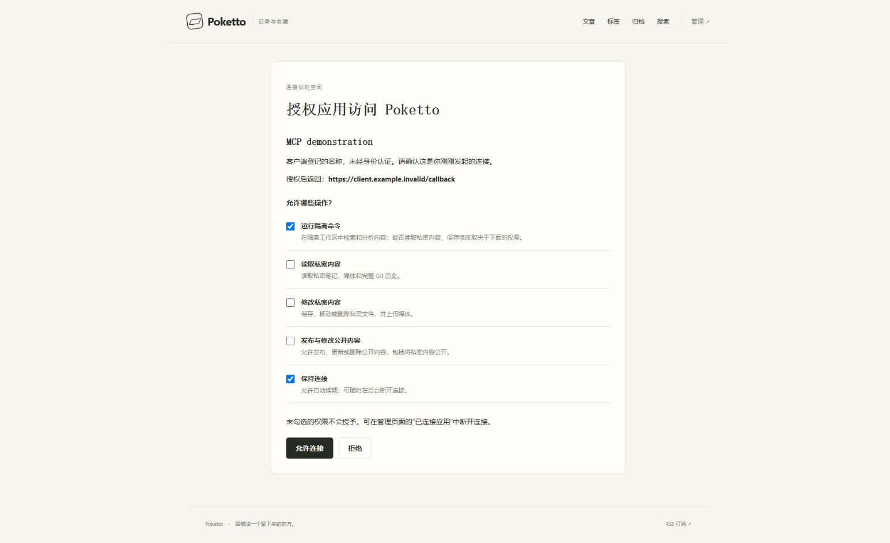

# MCP OAuth consent browser evidence

Source: `24ebec53ef5f9282c6039d6285fc1d59cd25d2d0` in `core607/poketto`.

The screenshot shows the real consent page after owner login, before approval. Repository execution and refresh are selected by default; private reading, private writing and publishing remain unchecked. The application name is explicitly identified as self-reported and the exact callback is visible.

Runtime: `gradlew stageAcceptanceRuntime`, then `docker compose --env-file .gradle/oauth/fixture.env -p poketto-oauth-acceptance -f acceptance/compose.yaml -f .gradle/oauth/override.json up --build -d`. The override sets the synthetic HTTPS issuer and a loopback backend port. The fresh fixture uses real PostgreSQL, Spring, the production Next.js build and Caddy, with isolated sample Git and media data. Chrome captured the page at its existing viewport; no image editing was applied. Frontend image configuration digest: `sha256:c7c16ca0797cd60da43f5ceaef3e1c7b10a2f5d57f47d4cde3697737e347da7b`.

The same run then approved the default scopes, exchanged the authorization code with PKCE, refreshed without an explicit resource, and disconnected the application in the admin UI. A subsequent access request returned 401 and refresh returned `invalid_grant`. These are protocol readbacks; the screenshot establishes only the consent layout and default selections.

Limitations: browser traffic used loopback HTTP. The nonresolving `client.example.invalid` callback represents a synthetic external client; its authorization response was consumed by a local test helper. This evidence does not establish public TLS or actual Claude/ChatGPT interoperability. No production accounts, content or credentials appear in the artifact.

