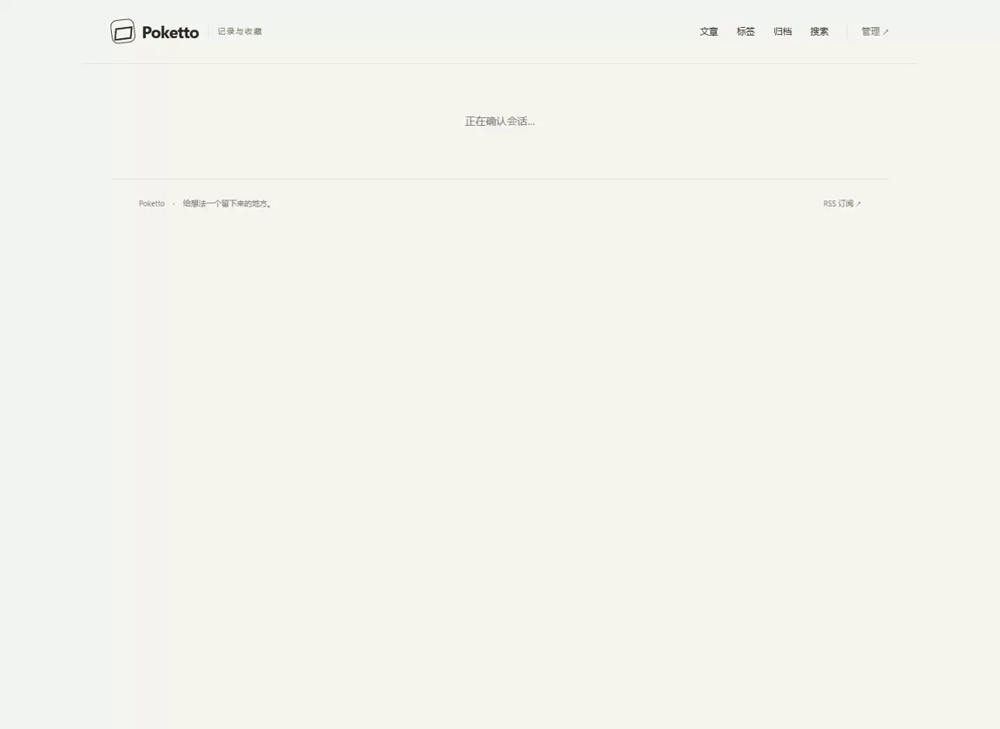

# Content-root browser evidence

Tested source: `7123e8e045a86e9e9298d07a706539ed665b7e69`.

Started with `./gradlew stageAcceptanceRuntime` and the supplied
`acceptance/compose.yaml` Docker Compose entrance. Dependencies are real Spring,
PostgreSQL, production Next.js, Caddy and native local originals; the remote Git
repository and all visible content are synthetic. Chrome 153.0.8010.36 runs at
1440 x 1050. The recording is one continuous isolated run; the GIF is its
2 fps, 1152 x 840 rendering.

The flow selects a public destination and cancels without a write, demonstrates
an actionable private-dependency refusal for one document, publishes its whole
folder, then withdraws the folder. Independent anonymous HTTP requests verify the
public route and original bytes, followed by denial of the withdrawn article and
old attachment URL. `checks.json` identifies the synthetic commits and assertions.
All application containers and data volumes were removed after acceptance.

This is local HTTP browser acceptance. It does not establish production-corpus
conversion, final HTTPS acceptance, every original media type or external MCP
client behavior. Screenshots and representative recording frames were inspected
for legibility and sensitive content before this evidence was retained.

