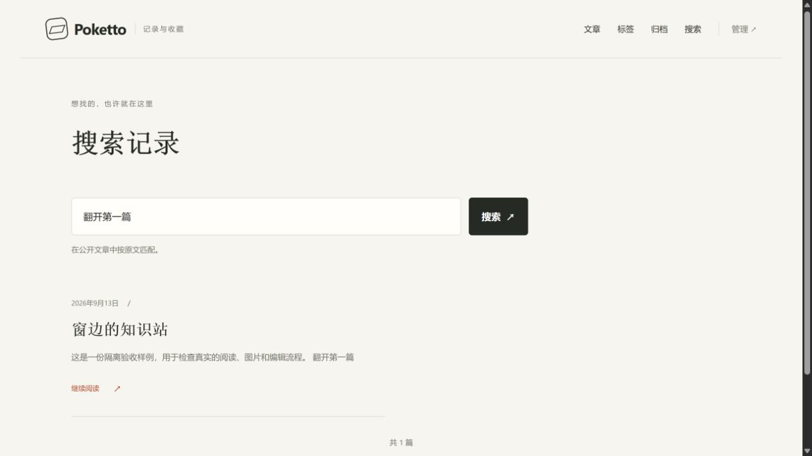

# Markdown reading-text browser evidence

Source: `9ef80c5de0b0005206ba5cb84359fe155fc24da0`.

The real Spring application, PostgreSQL, production Next.js build and Caddy serve a fresh synthetic repository. Searching for an authored link label returns its article with a plain-text summary. Searching for the link's hidden destination returns no articles. An independent public HTTP probe confirms both outcomes and excludes the private sentinel.

[checks.json](checks.json) records the source hashes, startup commands, browser dimensions, screenshot hash, checks and cleanup. The source was recorded before the run and committed unchanged afterward. The screenshot was captured from the rendered response of that same run. Login and unrelated private data are absent.

Only the standard desktop viewport screenshot is published. At a separate 390 by 844 CSS-pixel viewport, the browser measured a 390-pixel document width without horizontal overflow. This local HTTP fixture does not prove production HTTPS, cross-space discovery, collection navigation, match highlighting or restored reading position.

This branch contains review artifacts and must not be merged into the product branch.
