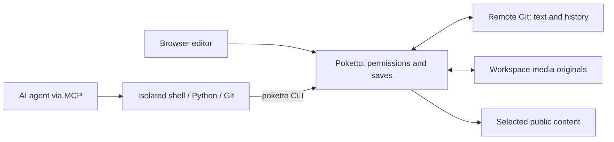

# Poketto

**A Git-native workspace for humans and AI agents.**

Give your agents a real repository workspace with shell, Python and Git. Edit the same knowledge base in your browser. Poketto isolates command execution, keeps repository credentials outside the sandbox, and checks permissions and revisions when saving or publishing.

Collect research, organize notes and images, maintain a reading list, or publish a blog and gallery. Your files and Git history remain inspectable with ordinary tools.

[中文说明](README.zh.md) · [Live instance](https://poketto.top) · [Self-host](docs/usage.md) · [Architecture](notes/implemented/2026-08-25-requirements-and-architecture.md)



## Why Poketto?

- A workspace agents can use directly. Agents follow repository-owned `AGENTS.md` files, search with ordinary commands, edit Markdown and process files. Five MCP tools provide execution, copy disposal, assets and artifacts; the `poketto` CLI handles saves, synchronization and media inside the workspace.
- Git-backed authoring. Browser edits and agent saves use the same atomic Git writer. Saves select files and explicit deletions, check remote revisions, and preserve unselected local edits. Conflicts remain visible; an uncertain save has a receipt to reconcile before retrying.
- Work survives reconnection. Authorized clients share a disk copy for the same account, space and reading scope. Commands run serially in isolated environments. Reconnects and ordinary service restarts retain the copy and its save state; command timeouts preserve files after the process tree stops. Copies have hard storage quotas and an explicit expiry.
- Private work and public views. New content belongs in `private/`; selected content is published from `public/`. Publication requires its own permission. Public-only agents receive a separate projection without private files, metadata or original Git history.

The external agent harness supplies the model and task planning. Poketto supplies authorized files, command execution and controlled access to remote Git and media storage.

## From a draft to a website

Write and preview Markdown in the browser, or let an agent organize the files through MCP. Add images and other attachments, review changes, and save selected content. Move chosen material into `public/` to publish it on an enabled space's website; supported Markdown references are repaired with the move.

The browser includes file and directory navigation, filename search, author attribution, album thumbnails and a lightbox. Each enabled space has a site at `/s/{slug}` with articles, tags, archives, search, galleries and ordered collections. The homepage discovers content across enabled public spaces, and site-wide search highlights matching text.

An installation starts with a default space. Accounts can connect existing private GitHub or CNB repositories as additional spaces. Registration and joining a space use separate invitations. Owners manage member permissions, API keys, OAuth connections, repository credentials and the website switch. The default space's website starts enabled; additional sites require a human owner to enable them.

## How agents work

Connect an MCP client using a scoped API key or [OAuth consent](docs/usage.md#oauth-connections): sign in, select a space and approve permissions. A connection never exceeds its holder's current permissions. Repository access requires an enabled executor and `EXECUTE_REPOSITORY`.

Call `repo_exec` with `expectedCopyId: "new"` to open the account's default copy, then reuse the returned `copyId`. Inside that copy, the agent reads `AGENTS.md` and `poketto --help`, uses shell/Python/Git for local work, and calls the host-mediated CLI:

| Command | Role |
|---|---|
| `poketto create` / `edit` | Create without overwriting, or replace an exact old text; stdin supports long input |
| `poketto status` | Inspect local state, save receipts and whether remote main matches the save/sync base |
| `poketto save` | Save selected files and explicit deletions; advance local Git after remote acknowledgement |
| `poketto sync` | Reconcile files with remote content while preserving local edits and surfacing conflicts |
| `poketto recover` | Reconcile an interrupted operation or uncertain write without blindly repeating it |
| `poketto move` | Move saved files, folders and indexed media, repairing supported Markdown references |
| `poketto media list` / `import` / `fetch` / `link` | Discover media, store originals, retrieve bytes or link an existing original |
| `poketto export` | Package saved documents and required originals into a private or public ZIP |
| `poketto artifact create` / `remove` | Deliver temporary images, text or binary results through MCP |

For files held by the client, `put_asset` supports a downloadable URL or a temporary raw-byte upload endpoint. The [file transfer guide](docs/usage.md#mcp-and-isolated-execution) describes client-specific handoff and linking the returned original into the workspace. Uploading alone does not save Git or publish content.

Copy IDs guard against silent replacement. Each successful authorized use renews the default seven-day idle deadline, returned in `retention.expiresAt`; `repo_discard` explicitly removes local work without undoing remote saves. Full and public reading scopes stay separate even for the same account. Permission checks apply to every command and host operation; revocation stops affected access.

These checks enforce granted capabilities. An agent with private-read and publish permissions can publish private material; interpreting user intent and handling prompt injection remain responsibilities of the external harness.

## File as truth

Markdown, directory structure and media references live in remote Git; its `main` branch is authoritative. Poketto serves public pages from verified snapshots. The application's repository cache is rebuildable; retained agent working copies separately hold unsaved work.

Uploaded images, audio, video, PDFs and other files live as immutable local originals. Git stores logical paths and versions in `.poketto/assets.json`; documents use relative links. Originals are deduplicated within each workspace. Equal bytes in different spaces retain separate storage and identities. PostgreSQL holds accounts, permissions and other relational application state.

Directory guides let agents discover existing organization without a fixed schema for every subject. The [content contract](notes/implemented/2026-09-09-codeact-content-and-media.md) defines the repository format; the [usage reference](docs/usage.md) owns interfaces and limits.

## Status and evidence

Poketto is in active development and has a deployed HTTPS installation. The records below identify what was exercised and where its evidence stops:

- [Client acceptance](acceptance/clients/README.md): real Codex and Claude Code workflows in an isolated environment.
- [Native executor verification](executor-native/README.md): production Java adapter, signed worker requests and Linux sandbox execution.
- [Daily-use delivery acceptance](notes/implemented/2026-09-15-multiuser-daily-use-acceptance.md): deployed topology, browser workflows and evidence limits.

The primary deployment is a self-hosted Linux server with a separately installed execution service and quota-enforced disk pool. Application, worker and content-format upgrades require coordination. Current releases do not promise interface or format compatibility.

Open self-registration, provider-side repository creation, built-in backups, visitor Q&A and the [optional serverless profile](notes/proposed/2026-09-01-optional-serverless-deployment-profile.md) are outside the current delivery scope.

## Develop and self-host

The application uses Java 26, Spring Boot, PostgreSQL 17 and a Next.js frontend. The separate Linux execution service runs the sandbox. Build with the checked-in Gradle Wrapper:

```sh
./gradlew test repoCheck
./gradlew check
```

The full check requires Docker, the pinned Node.js/npm runtime and the executor test prerequisites. On Windows use `.\gradlew.bat`. Application startup additionally requires PostgreSQL, an absolute data directory and a pre-provisioned private HTTPS Git repository for the default workspace. The first administrator is created from the deployment terminal, not from a browser form.

- [Development and operations](docs/usage.md): runtime prerequisites, configuration, publishing, MCP and deployment.
- [Browser acceptance](acceptance/README.md): run the real application with disposable synthetic data.
- [Execution service](executor-service/README.md): installation, protocol, CLI, limits and lifecycle.
- [AGENTS.md](AGENTS.md): contribution rules and checks. Reusable agent workflows live in `.agents/skills/`; architecture decisions live in `notes/`.

Verified `main` commits publish application and frontend images. Automatic deployment is enabled separately by the operator; local originals require their own persistence and backup arrangements.

## License

Code and project documents: [Apache-2.0](LICENSE).
Artwork and published creative content: [CC BY-NC-SA 4.0](https://creativecommons.org/licenses/by-nc-sa/4.0/).
