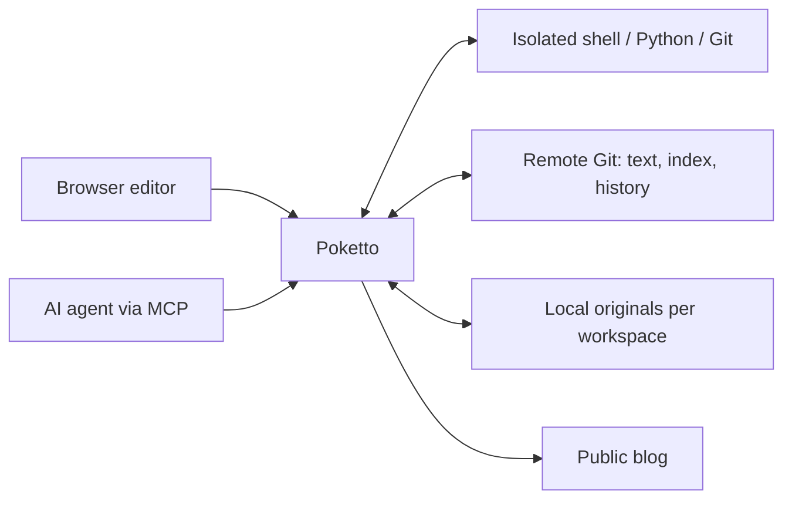

# Poketto

A personal knowledge workspace for you and your AI agents.

Keep notes, clippings, reading lists and project knowledge in files with Git history. Work on them in a browser or let an AI agent search, edit and organize them through MCP. Publish the content you choose as a blog.

[中文说明](README.zh.md) · [Development and operations](docs/usage.md) · [Architecture](notes/implemented/2026-08-25-requirements-and-architecture.md) · [Live instance](https://poketto.top)

## File as truth

New content belongs in `private/`; selected content is published from `public/`.
Each tree can use its own categories. Directory guides let agents discover where
records belong without a fixed schema for playlists, reading lists or other subjects.

Markdown, directory structure and media references live in a remote Git repository. Its `main` branch is authoritative; Poketto keeps a disposable local cache and serves public pages from verified snapshots. Browser edits and agent saves use the same atomic Git writer, with revision checks to preserve concurrent work.

Uploaded images, audio, video, PDFs and other files live as immutable local originals. Git stores their logical paths and versions in `.poketto/assets.json`; documents use relative links. Originals are deduplicated within each workspace. Equal bytes in different workspaces retain separate storage and identities, and uploading a file does not publish it.

Content stays inspectable with ordinary file and Git tools. PostgreSQL holds accounts, permissions and other relational application state.

## CodeAct over MCP

Connect an MCP client with a scoped API key or through OAuth consent: a member signs in, chooses a space and approves only permissions they already hold. The [OAuth setup](docs/usage.md#oauth-connections) supports a separate, revocable connection for each client; a connection never exceeds its holder's current permissions. File access requires an enabled executor and the `EXECUTE_REPOSITORY` capability. `repo_exec` provides an isolated workspace with shell, Python and Git. The agent can inspect the directory tree, follow repository-owned `AGENTS.md` files, search existing material and edit files in place.

The host-mediated `poketto` CLI provides persistence and result delivery:

| Command | Role |
|---|---|
| `poketto status` | Inspect the copy ID, session scope, save baseline and pending write outcome |
| `poketto save` | Commit selected files and explicit deletions, retaining other local edits |
| `poketto sync` | Reconcile one file against its own baseline and current remote content |
| `poketto recover` | Reconcile a pending save or move using its original commit and completion receipt |
| `poketto move` | Move saved files, folders and indexed media with Markdown reference repair |
| `poketto media list` / `import` / `fetch` / `link` | Discover indexed media, store originals, materialize referenced files or link existing workspace originals |
| `poketto export` | Package saved documents and required originals as a private or public ZIP |
| `poketto artifact create` / `remove` | Retain a temporary result for image, text or binary delivery through MCP, or release it early |

Repository credentials and original storage remain outside the sandbox. Ordinary edits stay in the execution session until saved. Conflicts retain local work; an uncertain acknowledgement must be reconciled before another save. Every execution copy has an ID that later calls must present; a replaced copy is refused rather than silently substituted. Unsaved session files can be discarded on expiry or restart unless the operator enables retained execution, which checkpoints acknowledged local work so that a reconnect resumes the same copy with its baseline and unsaved files; `repo_discard` removes such a copy explicitly.

This supports tasks such as updating a listening list, maintaining research notes, or organizing an article with its images. The agent discovers the workspace's organization from its files and guidance. The external agent harness supplies the model and decides how to carry out the task; Poketto supplies authorized data, execution and persistence.

## Spaces and views

An installation starts with the operator-configured default workspace. An account can connect an existing private GitHub or CNB repository as another space, and its owner can rotate the repository credentials later. Registration and workspace joining use separate invitations. Ordinary membership grants public-scope reading; owners explicitly grant private reading, private writing and publication, and reducing a member's grants revokes keys and connections that would exceed them.

The browser provides a Markdown editor, file and directory navigation, image previews, and a destination picker for moves. File and folder moves repair supported Markdown references in the same commit. The workspace dashboard manages members and their permissions, API keys, OAuth connections, workspace invitations, the repository connection and the website switch.

The default workspace's website starts enabled; another space's website stays off until a human owner enables it, and an owner can switch either off. An enabled site lives at `/s/{slug}` with article routes, tags, archive, search and image galleries over the content allowed by publication policy; search matches the parsed Markdown reading text, and folder landing pages define a collection order that article reading keeps through previous and next links. The homepage samples cards from enabled public spaces into a stable batch.

Execution receives the same permission boundary: full readers get authorized current files and original Git history; public-only readers get a fresh public projection with private metadata and original history excluded. Sessions are isolated even when clients share a key. Revocation and publication withdrawal invalidate affected execution sessions.



API capabilities govern reads, writes, publishing and execution. An agent granted both private-read and publish capabilities can publish private material; the external harness remains responsible for interpreting user intent and handling prompt injection.

## Development status

Poketto is under active development. Implemented: repository authoring, local media, browser moves, the CodeAct save/media workflow, invitation-based accounts with explicit member permissions, OAuth connections, additional spaces from existing repositories, per-space websites with cross-space discovery and collection reading, and retained execution across reconnects. [Client acceptance](acceptance/clients/README.md) records real Codex and Claude Code workflows in an isolated environment; [native executor verification](executor-native/README.md) exercises the Linux isolation boundary. The [delivery acceptance](notes/implemented/2026-09-15-multiuser-daily-use-acceptance.md) records the HTTPS installation, deployed topology and evidence limits.

Content uses default-private `public/` and `private/` roots. The browser and CodeAct CLI support scope-aware moves and ZIP exports with actual originals and relative links. MCP file work uses the isolated workspace and host CLI. The [content contract](notes/implemented/2026-09-09-codeact-content-and-media.md) defines the format; existing repositories need a coordinated content/application conversion before upgrading. Current interfaces and limits are in the [usage reference](docs/usage.md).

The [multi-user delivery](notes/implemented/2026-09-11-multiuser-workspaces-and-discovery.md) implements accounts, spaces and public discovery, including author and space attribution on cards, album thumbnails and a lightbox, README fallback for folder landings, site-wide search with highlighted matches and return to results, in-directory new note and folder actions with filename search, and restorable management URLs.

The primary deployment is a self-hosted Linux server. Open self-registration, provider-side repository creation, backups, visitor Q&A and the [optional serverless profile](notes/proposed/2026-09-01-optional-serverless-deployment-profile.md) are outside the current delivery scope.

## Develop and self-host

The application uses Java 26, Spring Boot, PostgreSQL 17 and a Next.js frontend. The separate Linux execution service runs the sandbox. Build with the checked-in Gradle Wrapper:

```sh
./gradlew test repoCheck
./gradlew check
```

The full check requires Docker, the pinned Node.js/npm runtime and the executor test prerequisites. On Windows use `.\gradlew.bat`. Application startup additionally requires PostgreSQL, an absolute data directory and a pre-provisioned private HTTPS Git repository for the default workspace. The first administrator is created from the deployment terminal, not from a browser form.

- [Development and operations](docs/usage.md): runtime prerequisites, configuration, publishing, MCP and deployment.
- [Browser acceptance](acceptance/README.md): run the real application with disposable synthetic data.
- [Execution service](executor-service/README.md): installation, protocol, CLI, limits and lifecycle.
- [AGENTS.md](AGENTS.md): contribution rules and checks. Reusable agent workflows live in `.agents/skills/`; architecture decisions live in `notes/`.

Verified `main` commits publish application and frontend images. Automatic deployment is enabled separately by the operator; local originals require their own persistence and backup arrangements.

## License

Code and project documents: [Apache-2.0](LICENSE).
Artwork and published creative content: [CC BY-NC-SA 4.0](https://creativecommons.org/licenses/by-nc-sa/4.0/).
