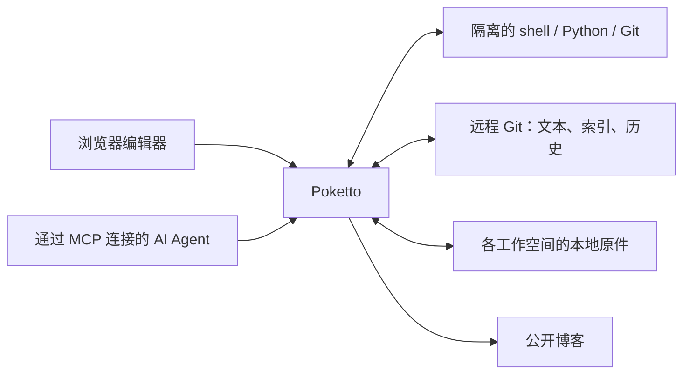

# Poketto

你和 AI Agent 共用的个人知识空间。

用文件和 Git 历史保存笔记、剪藏、阅读清单与项目资料。在浏览器里整理，也可以让 AI 通过 MCP 搜索、编辑和归档，再把选定的内容发布成博客。

[English](README.md) · [开发与使用](docs/usage.zh.md) · [架构](notes/implemented/2026-08-25-requirements-and-architecture.zh.md)

## File as truth

新内容放在 `private/`，选定内容从 `public/` 发布。两棵目录可以各自组织分类；目录指引帮助 Agent 找到已有记录的位置，无须为歌单、阅读清单等主题分别设计固定结构。

Markdown、目录结构与媒体引用保存在远程 Git 仓库中。远端 `main` 是权威来源；Poketto 保留可重建的本地缓存，通过经过验证的快照提供公开页面。浏览器编辑和 Agent 保存共用原子 Git 写入服务，以版本检查保护并发修改。

上传的图片、音频、视频、PDF 和其他文件作为不可变原件保存在本地。Git 通过 `.poketto/assets.json` 记录逻辑路径和版本，文档使用相对链接。原件仅在各自的工作空间内去重；不同工作空间即使上传相同字节，也保留独立存储和身份。上传文件本身不会公开它。

内容可以用普通文件工具和 Git 查看、维护。PostgreSQL 保存账号、权限等关系型应用状态。

## CodeAct over MCP

用具有明确权限的 API Key，或通过 OAuth 授权连接 MCP 客户端：成员登录后选择空间，只能批准自己已持有的权限。[OAuth 配置](docs/usage.md#oauth-connections)为每个客户端建立可独立撤销的连接；连接的权限不会超过持有者当前的权限。文件访问要求启用执行服务并授予 `EXECUTE_REPOSITORY` 权限。`repo_exec` 提供带 shell、Python 和 Git 的隔离工作区。Agent 可以查看目录、按需读取内容仓库中的 `AGENTS.md`、搜索已有资料，并直接编辑文件。

工作区内的 `poketto` CLI 通过宿主桥接提供持久化与结果交付：

| 命令 | 用途 |
|---|---|
| `poketto status` | 查看副本 ID、会话范围、保存基线和待核实的写入结果 |
| `poketto save` | 提交选定文件和明确删除，保留其他本地编辑 |
| `poketto sync` | 按单个文件的基线与远端当前内容进行合并 |
| `poketto recover` | 使用原始提交和完成回执核实待处理的保存或移动 |
| `poketto move` | 移动已保存的文件、目录和索引媒体，并修复 Markdown 引用 |
| `poketto media list` / `import` / `fetch` / `link` | 发现索引中的媒体、存储原件、把引用的文件取到工作区，或链接工作空间里已有的原件 |
| `poketto export` | 将已保存文档和所需原件打包为私人或公开 ZIP |
| `poketto artifact create` / `remove` | 保留临时结果，通过 MCP 返回图片、文本或二进制，或提前释放它 |

仓库凭证和原件存储留在沙箱之外。普通编辑在保存前只存在于执行会话中。冲突保留本地工作；保存是否成功尚不明确时，须先核实，再继续保存。每个执行副本都有 ID，后续调用必须带上；副本被替换时会拒绝执行，而不是悄悄换成新副本。会话过期或重启可能丢弃未保存的文件，除非运维启用保留执行：已确认的本地工作会写入检查点，重连后恢复同一副本及其基线和未保存文件；`repo_discard` 显式删除这样的副本。

更新歌单、维护研究笔记、整理一篇文章及其配图，都可以沿用这套方式。Agent 从文件和目录指引中发现工作空间的组织方式。外部 Agent Harness 提供模型并决定如何执行任务，Poketto 提供授权范围内的数据、执行环境和持久化能力。

## 空间与视图

安装后先有运维配置的默认工作空间。账号可以把已有的私有 GitHub 或 CNB 仓库接入为另一个空间，其所有者之后可以轮换仓库凭证。注册与加入空间使用各自独立的邀请。普通成员身份只授予公开范围的读取；私密读取、私密修改和公开发布由所有者明确授予，成员权限缩减时，超出范围的 Key 和连接会被撤销。

浏览器提供 Markdown 编辑器、文件与目录导航、图片预览，以及移动文件时使用的目标目录选择器。文件或文件夹移动会在同一次提交中修复支持的 Markdown 引用。工作空间面板管理成员及其权限、API Key、OAuth 连接、空间邀请、仓库连接和网站开关。

默认工作空间的网站一开始就是开启的；其他空间的网站保持关闭，直到人类所有者开启，所有者也可以关闭任一空间的网站。开启后的站点位于 `/s/{slug}`，按发布策略提供文章路由、标签、归档、搜索和图片画廊；搜索匹配解析后的 Markdown 阅读文本，目录落地页决定合集顺序，文章阅读通过上一篇、下一篇保持该合集。首页从已开启的公开空间中抽样卡片，组成顺序稳定的一批。

执行环境遵循相同的权限边界：完整读取权限的会话获得授权范围内的当前文件和原始 Git 历史；仅公开读取的会话获得新的公开投影，不包含私密元数据和原始历史。即使客户端共用一个 Key，会话仍相互隔离。撤权和取消公开会使受影响的执行会话失效。



API 权限分别约束读取、写入、发布和执行。Agent 如果同时拥有私密读取与发布权限，就具备把私密资料发布出去的能力；理解用户意图、处理提示词注入仍由外部 Harness 负责。

## 开发状态

Poketto 正在开发中。已实现：仓库创作、本地媒体、浏览器移动、CodeAct 的保存和媒体流程、基于邀请的账号与明确的成员权限、OAuth 连接、从已有仓库接入额外空间、带跨空间发现与合集阅读的分空间网站，以及跨重连保留执行工作。[客户端验收](acceptance/clients/README.md)记录了隔离环境中的真实 Codex 和 Claude Code 工作流；[原生执行验证](executor-native/README.md)覆盖 Linux 隔离边界。最终 HTTPS 安装与部署拓扑的验收尚未记录。

内容采用默认私密的 `public/`、`private/` 双根目录。浏览器和 CodeAct CLI 支持切换公开范围的移动，以及包含实际原件和相对链接的 ZIP 导出。MCP 文件操作统一通过隔离工作区和宿主 CLI 完成。[内容契约](notes/implemented/2026-09-09-codeact-content-and-media.md)定义仓库格式；已有仓库升级前需要协调转换内容与应用版本。当前接口及限制见[使用文档](docs/usage.zh.md)。

[多用户交付方案](notes/proposed/2026-09-11-multiuser-workspaces-and-discovery.md)是账号、空间和公开发现的既定目标。其余待做的是卡片上的作者与空间署名、相册缩略图与灯箱、目录落地页回退到 README、带高亮与返回结果的全站搜索、当前目录内的新建笔记与文件夹及文件名搜索，以及可恢复的管理页面 URL。

主要部署形态是自托管 Linux 服务器。开放注册、在托管平台上代建仓库、备份、访客问答和[可选 serverless 方案](notes/proposed/2026-09-01-optional-serverless-deployment-profile.md)不在当前交付范围内。

## 开发与自托管

应用使用 Java 26、Spring Boot、PostgreSQL 17 和 Next.js 前端，独立的 Linux 执行服务负责沙箱。使用仓库内的 Gradle Wrapper 构建：

```sh
./gradlew test repoCheck
./gradlew check
```

完整校验需要 Docker、固定版本的 Node.js/npm 和执行服务测试依赖。Windows 使用 `.\gradlew.bat`。启动应用还需要 PostgreSQL、绝对路径的数据目录，以及为默认工作空间预先准备好的私有 HTTPS Git 仓库。第一个管理员在部署主机的终端里创建，没有浏览器表单。

- [开发与使用](docs/usage.zh.md)：运行依赖、配置、发布策略、MCP 和部署。
- [浏览器验收](acceptance/README.md)：使用可丢弃的测试数据运行真实应用。
- [执行服务](executor-service/README.md)：安装、协议、CLI、限制和生命周期。
- [AGENTS.md](AGENTS.md)：贡献规则与检查。可复用的 Agent 工作流程位于 `.agents/skills/`，架构决策记录位于 `notes/`。

通过验证的 `main` 提交会发布应用与前端镜像。自动部署由运维单独启用；本地原件需要独立的持久化与备份安排。

## 授权

代码与项目文档：[Apache-2.0](LICENSE)。
美术素材与站点发布的创作内容：[CC BY-NC-SA 4.0](https://creativecommons.org/licenses/by-nc-sa/4.0/deed.zh-hans)。
