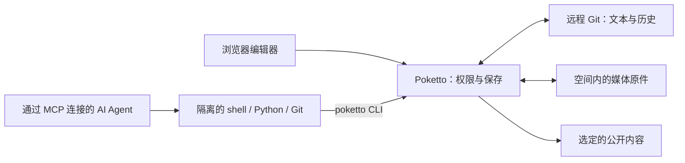

# Poketto

**人和 AI Agent 共用的 Git 原生工作空间。**

给 Agent 一份真正能用 shell、Python 和 Git 操作的仓库工作区，也让你在浏览器里编辑同一份知识库。Poketto 隔离命令执行，把仓库凭证留在沙箱之外，并在保存与发布时检查权限和版本。

收集研究资料、整理笔记与图片、维护阅读清单，或发布博客和相册。文件和 Git 历史始终可以用普通工具查看、维护。

[English](README.md) · [线上实例](https://poketto.top) · [自托管](docs/usage.zh.md) · [架构](notes/implemented/2026-08-25-requirements-and-architecture.zh.md)



## 为什么用 Poketto？

- Agent 可以直接使用的工作区。 Agent 按需读取内容仓库中的 `AGENTS.md`，用普通命令搜索、编辑 Markdown、处理文件。五个 MCP 工具提供执行、副本清理、资源和产物交付；工作区内的 `poketto` CLI 负责保存、同步与媒体操作。
- 基于 Git 的创作。 浏览器编辑和 Agent 保存共用原子 Git 写入服务。保存只提交选定文件和明确删除，检查远端版本，并保留未选中的本地编辑。冲突会明确呈现；保存结果不确定时，可通过回执核实后再决定是否重试。
- 重连后继续工作。 获得授权的客户端按账号、空间和读取范围共享磁盘副本，命令在隔离环境中串行执行。重连和普通服务重启保留副本与保存状态；命令超时后，确认进程树停止再保留文件。副本有硬存储配额和明确的到期时间。
- 私密创作与公开视图。 新内容放在 `private/`，选定内容从 `public/` 发布，发布需要独立权限。只有公开读取权限的 Agent 获得单独的公开投影，不包含私密文件、元数据和原始 Git 历史。

外部 Agent Harness 提供模型并规划任务。Poketto 提供授权范围内的文件、命令执行，以及受控的远程 Git 和媒体存储访问。

## 从草稿到网站

在浏览器里编写、预览 Markdown，或让 Agent 通过 MCP 整理文件。加入图片和其他附件，检查修改，保存选定内容。将选中的内容移入 `public/`，便会发布到已开启的空间网站；移动时会一起修复支持的 Markdown 引用。

浏览器提供文件与目录导航、文件名搜索、作者署名、相册缩略图与灯箱。每个已开启的空间在 `/s/{slug}` 提供文章、标签、归档、搜索、画廊和有序合集。首页展示多个公开空间的内容，全站搜索会高亮匹配文本。

安装后先有默认空间。账号可把已有的私有 GitHub 或 CNB 仓库接入为额外空间。注册与加入空间使用各自独立的邀请。所有者管理成员权限、API Key、OAuth 连接、仓库凭证和网站开关。默认空间的网站一开始开启，额外空间的网站需要人类所有者开启。

## Agent 如何工作

用具有明确权限的 API Key，或通过 [OAuth 授权](docs/usage.md#oauth-connections)连接 MCP 客户端：登录、选择空间并批准权限。连接的权限不会超过持有者当前的权限。仓库访问要求启用执行服务并授予 `EXECUTE_REPOSITORY`。

调用 `repo_exec`，传入 `expectedCopyId: "new"` 打开账号的默认副本，后续复用返回的 `copyId`。Agent 在副本内读取 `AGENTS.md` 和 `poketto --help`，用 shell、Python、Git 处理本地文件，再通过宿主桥接的 CLI 操作：

| 命令 | 用途 |
|---|---|
| `poketto create` / `edit` | 创建时不覆盖已有文件，或精确匹配原文后替换；长文本可从 stdin 输入 |
| `poketto status` | 查看本地状态、保存回执，以及远端 main 是否匹配保存或同步基线 |
| `poketto save` | 保存选定文件和明确删除；远端确认后更新本地 Git |
| `poketto sync` | 与远端内容协调，保留本地编辑并呈现冲突 |
| `poketto recover` | 核实中断操作或不确定的写入，避免盲目重复执行 |
| `poketto move` | 移动已保存的文件、目录和索引媒体，修复支持的 Markdown 引用 |
| `poketto media list` / `import` / `fetch` / `link` | 发现媒体、存储原件、取回文件或链接已有原件 |
| `poketto export` | 将已保存文档和所需原件打包为私人或公开 ZIP |
| `poketto artifact create` / `remove` | 通过 MCP 交付临时图片、文本或二进制产物 |

客户端持有的文件可通过 `put_asset` 提供可下载 URL，或获取临时入口上传原始字节。[文件传输说明](docs/usage.zh.md#mcp-与隔离执行)介绍不同客户端的交接方式，以及如何把返回的原件链接进工作区。上传本身不会保存 Git，也不会发布内容。

副本 ID 防止工作区被悄悄替换。每次成功的授权使用都会续期，默认闲置七天后到期，期限由 `retention.expiresAt` 返回；`repo_discard` 显式删除本地工作，不撤销远端保存。同一账号的完整读取与公开读取范围仍然隔离。每条命令和宿主操作都会检查权限，撤权会停止受影响的访问。

这些检查约束已授予的能力。Agent 若同时拥有私密读取和发布权限，就能发布私密资料；理解用户意图、处理提示词注入仍由外部 Harness 负责。

## File as truth

Markdown、目录结构和媒体引用保存在远程 Git 中，远端 `main` 是权威来源。Poketto 通过经过验证的快照提供公开页面。应用的仓库缓存可以重建；Agent 保留的工作副本则单独存放未保存的工作。

上传的图片、音频、视频、PDF 和其他文件作为不可变原件保存在本地。Git 通过 `.poketto/assets.json` 记录逻辑路径和版本，文档使用相对链接。原件仅在各自的空间内去重；不同空间即使上传相同字节，也保留独立存储和身份。PostgreSQL 保存账号、权限等关系型应用状态。

目录指引帮助 Agent 发现已有组织方式，无须为每种主题设计固定结构。[内容契约](notes/implemented/2026-09-09-codeact-content-and-media.md)定义仓库格式，[使用文档](docs/usage.zh.md)维护接口和限制。

## 状态与验证记录

Poketto 正在开发中，已有运行中的 HTTPS 安装。以下记录说明验证了哪些能力，以及证据的适用范围：

- [客户端验收](acceptance/clients/README.md)：隔离环境中的真实 Codex 和 Claude Code 工作流。
- [原生执行验证](executor-native/README.md)：生产 Java 适配器、带签名的 worker 请求与 Linux 沙箱执行。
- [日常使用交付验收](notes/implemented/2026-09-15-multiuser-daily-use-acceptance.md)：部署拓扑、浏览器工作流和证据边界。

主要部署形态是自托管 Linux 服务器，需要单独安装执行服务并配置强制配额的磁盘池。应用、worker 和内容格式的升级需要协调，当前版本不承诺接口或格式兼容。

开放注册、在托管平台上代建仓库、内置备份、访客问答和[可选 serverless 方案](notes/proposed/2026-09-01-optional-serverless-deployment-profile.md)不在当前交付范围内。

## 开发与自托管

应用使用 Java 26、Spring Boot、PostgreSQL 17 和 Next.js 前端，独立的 Linux 执行服务负责沙箱。使用仓库内的 Gradle Wrapper 构建：

```sh
./gradlew test repoCheck
./gradlew check
```

完整校验需要 Docker、固定版本的 Node.js/npm 和执行服务测试依赖。Windows 使用 `.\gradlew.bat`。启动应用还需要 PostgreSQL、绝对路径的数据目录，以及为默认工作空间预先准备好的私有 HTTPS Git 仓库。第一个管理员在部署主机的终端里创建，没有浏览器表单。

- [开发与使用](docs/usage.zh.md)：运行依赖、配置、发布策略、MCP 和部署。
- [浏览器验收](acceptance/README.md)：使用可丢弃的测试数据运行真实应用。
- [执行服务](executor-service/README.md)：安装、协议、CLI、限制和生命周期。
- [AGENTS.md](AGENTS.md)：贡献规则与检查。可复用的 Agent 工作流程位于 `.agents/skills/`，架构决策记录位于 `notes/`。

通过验证的 `main` 提交会发布应用与前端镜像。自动部署由运维单独启用；本地原件需要独立的持久化与备份安排。

## 授权

代码与项目文档：[Apache-2.0](LICENSE)。
美术素材与站点发布的创作内容：[CC BY-NC-SA 4.0](https://creativecommons.org/licenses/by-nc-sa/4.0/deed.zh-hans)。
