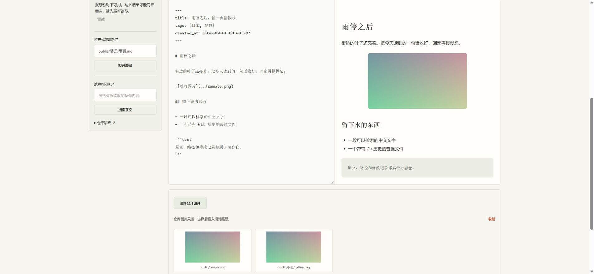

# Member image picker with an invalid media index

Source: `ad2f22388b408d0d1c2305016211829994864e3d`. The screenshot comes from one fresh isolated run of the real Spring application, pinned PostgreSQL, production Next.js and Caddy. A synthetic Git authority contains a deliberately malformed `.poketto/assets.json`; no user repository or credentials are included.

A member with public publishing permission opens a public document by its full path. Its Git image renders and the public image picker lists both eligible Git images. Independent authenticated HTTP requests and Git readback verify the exact document bytes, the two image paths, private/excluded source denial, and that the index is the fixture's only changed file. The directory explicitly reports unavailability, preserving the distinction between a broken index and an empty directory.

[Checks and screenshot digest](checks.json). This single state does not establish timing, complete directory recovery, saving with a malformed index, external OAuth/MCP clients or production HTTPS. The earlier complete member workflow remains separately attributed to source `741048a`; this supplement covers the narrower index-handling change. Do not merge this artifact branch.
