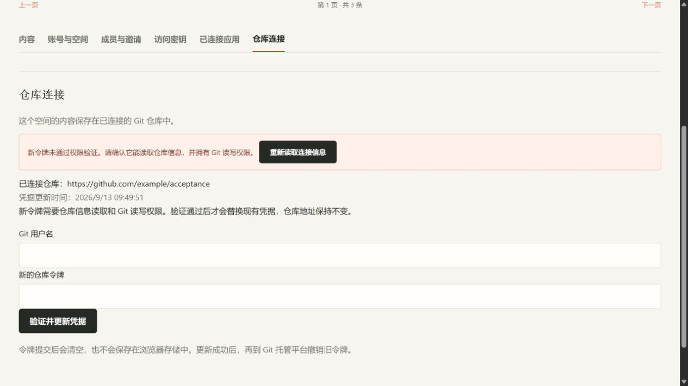
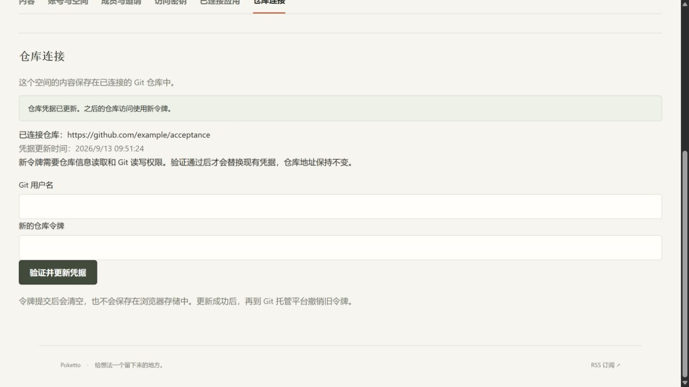

# Repository credential settings with explicit member permissions

Source: `bce0e09f7e6c81b2be28a279f3036ec750d7b5fe`.

The credential settings run with the merged member-permission implementation in a fresh Spring, PostgreSQL, Next.js and Caddy fixture. An invalid synthetic provider token leaves the encrypted binding and update timestamp unchanged. A valid synthetic replacement changes both while preserving the workspace, fixed repository address and private website setting. Browser inputs clear after both outcomes. Database inspection verifies the two outcomes independently of the page messages.

[checks.json](checks.json) records source, startup command, viewport and screenshot hashes. The screenshots are original captures from one run and show stable states, not measured transition timing. The integration-only provider verifies fixed synthetic strings; no request or credential goes to GitHub or CNB. This does not establish real provider credentials, external MCP clients or production HTTPS acceptance.
