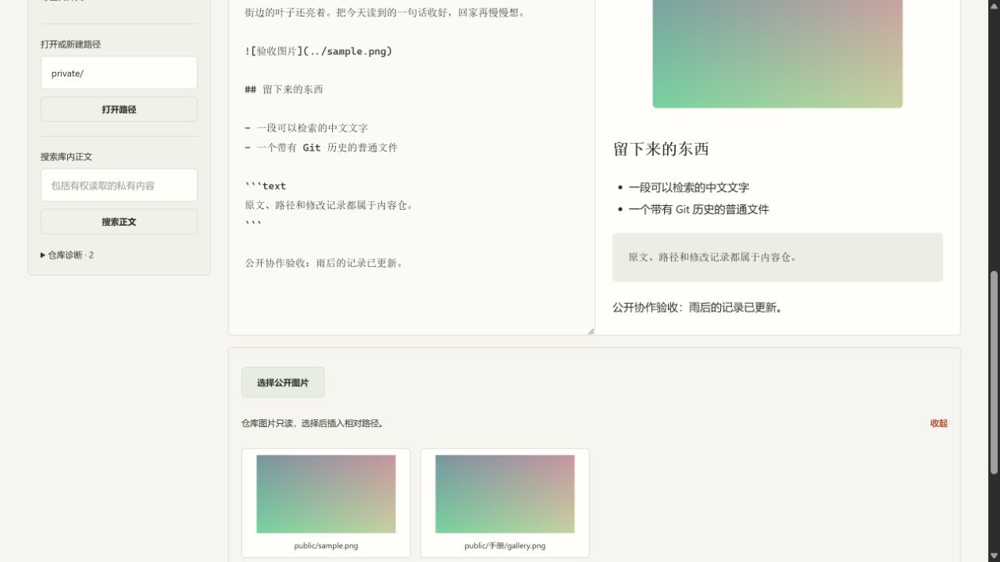
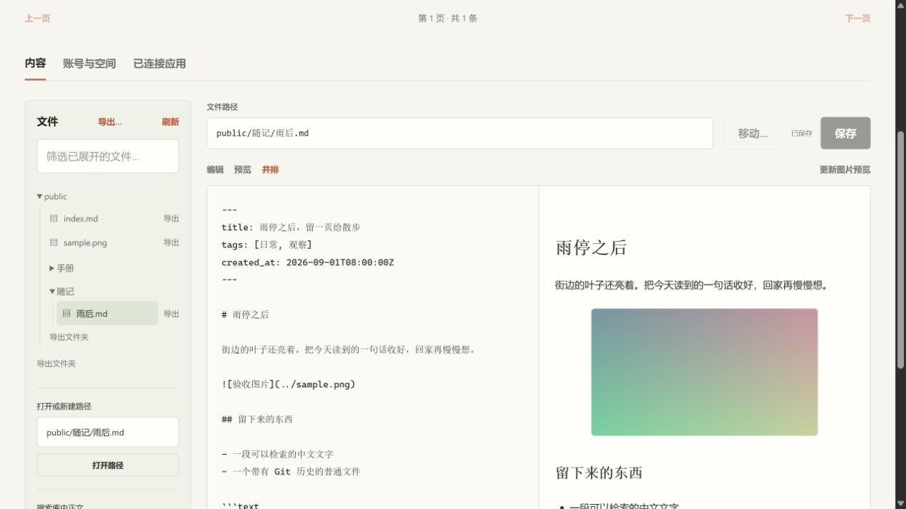

# Member permission browser evidence

Source: `edf1b6fe28429d607c0bef77984255a2fbc2524c`.

The current Java-style and shared-helper baseline runs in a fresh isolated Spring, PostgreSQL, Next.js and Caddy stack with synthetic Git authorities. Runtime staging used `./gradlew stageAcceptanceRuntime`; startup used `docker compose -p poketto-member-main-ui --env-file .gradle/member-main-ui/acceptance.env -f acceptance/compose.yaml up --build -d`.

A member with publication permission and no private permissions saved a public article. Independent Git readback matches the browser text exactly and confirms that only that article changed. Private and excluded paths returned 403. A denied private-file open retained the public preview. Removing publication permission through the real owner endpoint left the member able to read public content, with the editor read-only and save disabled after reload.

[checks.json](checks.json) records the source commit, viewport, image dimensions, source comparison and screenshot hashes. Both screenshots are unmodified browser captures from the same run; they show stable states, not transition timing. Fixtures use no live provider credentials. This does not establish production HTTPS, external OAuth/MCP interoperability or public-only machine authoring.
