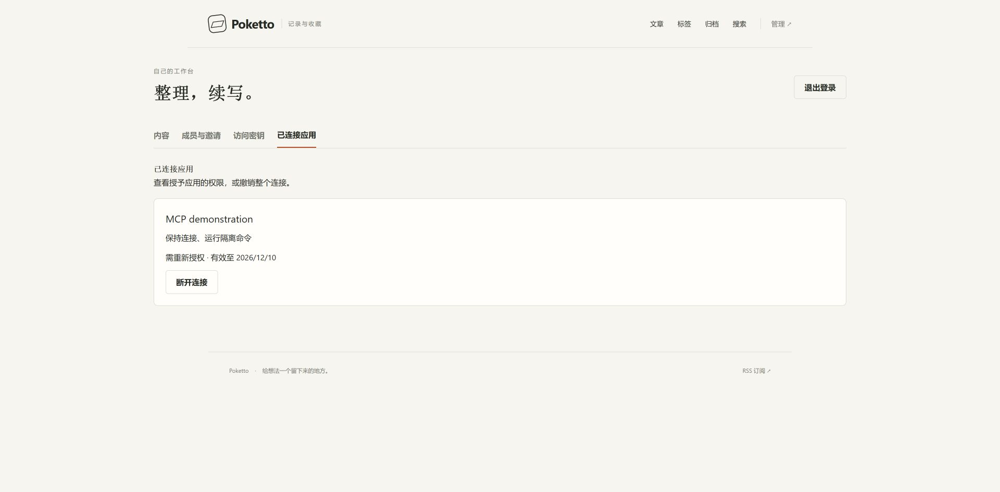

# Connection state after changing the issuer

Source: `198e70accee2c124214c68f0db2175f768418e9c`. Frontend image configuration digest: `sha256:3aa555fb7f1ff4477839c5346fb2d364d6be799a39ec907f2479fdb394696484`.

A fresh isolated `poketto-oauth-acceptance` Compose project started through `gradlew stageAcceptanceRuntime` and `acceptance/compose.yaml` with the OAuth environment override. Real PostgreSQL, Spring, production Next.js and Caddy used disposable sample Git/media data. Chrome owner login approved only execution and refresh; a helper exchanged the callback code with PKCE and refreshed successfully.

The application then restarted with `POKETTO_OAUTH_ISSUER` changed from `https://oauth.example.invalid` to `https://changed.example.invalid`, preserving its PostgreSQL and application volumes. The normal acceptance seeder intentionally refuses a nonempty root. The attached `Resume.java` therefore starts the same Spring application and local repository test configuration without reseeding or recreating the account. Its environment points at the existing `/tmp/poketto-acceptance/data` and `/tmp/poketto-acceptance/remote.git`, keeps loopback allowed origin and disables Secure cookies only in this HTTP fixture. Product source and compiled classes remain unchanged.

After signing in again, administration displays the stored connection as “需重新授权” and still permits disconnection. Old access returns 401 and refresh returns `invalid_grant`. The screenshot captures this stable UI state at Chrome's default 1920-by-945 viewport; it is unedited and contains no production data or credentials.

This artifact verifies the changed connection-state display and persistence across a real application restart. It does not establish public TLS or actual Claude/ChatGPT interoperability. The separate consent-layout artifact uses its own earlier isolated run and provenance.

